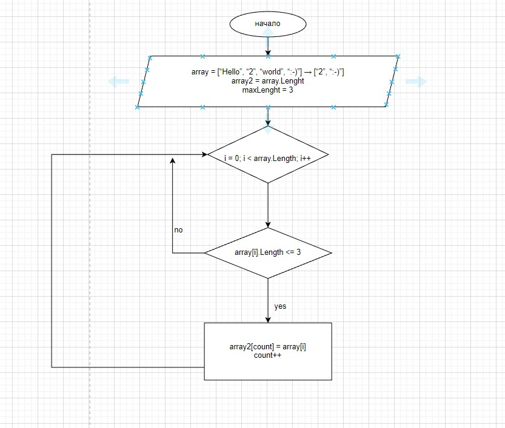

# final_work
Итоговая проверочная работа

Данная работа необходима для проверки ваших знаний и навыков по итогу прохождения первого блока обучения на программе Разработчик. Мы должны убедится, что базовое знакомство с IT прошло успешно.

Задача алгоритмически не самая сложная, однако для полноценного выполнения проверочной работы необходимо:

1. Создать репозиторий на GitHub
2. Нарисовать блок-схему алгоритма (можно обойтись блок-схемой основной содержательной части, если вы выделяете её в отдельный метод)
3. Снабдить репозиторий оформленным текстовым описанием решения (файл README.md)
4. Написать программу, решающую поставленную задачу
5. Использовать контроль версий в работе над этим небольшим проектом (не должно быть так, что всё залито одним коммитом, как минимум этапы 2, 3, и 4 должны быть расположены в разных коммитах)

Задача: Написать программу, которая из имеющегося массива строк формирует новый массив из строк, длина которых меньше, либо равна 3 символам. Первоначальный массив можно ввести с клавиатуры, либо задать на старте выполнения алгоритма. При решении не рекомендуется пользоваться коллекциями, лучше обойтись исключительно массивами.

Примеры:
[“Hello”, “2”, “world”, “:-)”] → [“2”, “:-)”]
[“1234”, “1567”, “-2”, “computer science”] → [“-2”]
[“Russia”, “Denmark”, “Kazan”] → []

## Блок схема алгоритма 

Для графического представления Блок схемы использован сайт 
[Блок схемы](https://app.diagrams.net/)
для меня это самая  удобная форма для представления Блок схем. В данной программе(сайте) можно сохранять свои шаблоны для создания блок-схем, это позволяет в считанные минуты создать свой проект. создается файл с расширением DRAWIO.

## Текстовое описание
[GitHub](https://e-mba.ru/uploads/campus/images/1636531328_article_10112021.jpeg) 

1. Вводим первоначальный массив типа string []
наименование массива __MyArray__.
1. Вводим второй массив __MyArray1__ равный по длинне __MyArray__ в который помещаем подходящие по условиям задачи элементы массива.
1. вносим глобальную переменную __int maxLenght__ в нашем случае переменная  равна 3. 
1. создаем метод __CutArray__ кототрый будет выполнять выборку элементов массива соответствующих условиям задачи. для этого создаем локальную переменную _int count = 0_. отсчет начинается с 0. создаем цикл _for_ условия цикла стандартыные(перебор всех элементов массива начиная с 0го индекса и до последнего элемента массива включительно) в цикле проводим выборку _if_ по условиям задачи(элемент должен быть <= 3 символам) и если условия выполняются, то индекс элемента подходящий по условиям добавляется в наш массив. 
1. создаем Метод __PrintArray__ выводящий наш массив на печать. 
внутри массива цикл _*for*_ - добавляет все элементы массива для вывода на консоль. 
2. Оформляем по нашему желанию,  вывод на консоль при помощи метода __PrintArray__. 

class Program
{
    static void Main(string[] args)
    {

        string[] MyArray = { "123", "23", "hello", "world", "res" };

        string[] MyArray1 = new string[MyArray.Length];

        int maxLength = 3;

        void CutArray(string[] array1, string[] array2)
        {
            int count = 0;
            for (int i = 0; i < array1.Length; i++)
            {
                if (array1[i].Length <= maxLength)
                {
                    array2[count] = array1[i];
                    count++;
                }
            }
        }
        void PrintArray(string[] array)
        {
            for (int i = 0; i < array.Length; i++)
            {
                Console.Write($" {array[i]} ");
            }
            Console.WriteLine();
        }
        CutArray(MyArray, MyArray1);
        Console.Write($"Элементы массива для обработки:  ");
        PrintArray(MyArray);
        Console.Write($"Элементы массива соответствующие условиям задачи:  ");
        PrintArray(MyArray1);

    }
}

